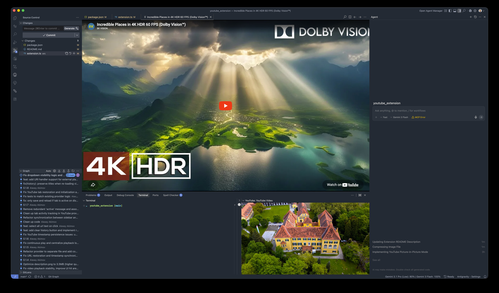

# YouTube Player for VS Code 📺

Watch YouTube videos inside VS Code — in the sidebar or in a full editor tab. Search YouTube, open playlists, follow tutorials, listen to music or keep a live stream running, without ever leaving the editor. 🚀

## ✨ Features

- 🚀 **Dual-View Support**: Watch videos in a dedicated **Sidebar Panel** or open them in a large **Editor Tab** for better visibility.
- 🔍 **Integrated Search**: Find and browse videos directly within the extension UI — no more switching windows to find the right tutorial.
- 🔗 **Smart Link Support**: Paste any YouTube link into the search bar to play it instantly.
- 🎶 **Playlists Support**: Seamlessly manage YouTube playlists with intuitive navigation controls and full state recovery across restarts.
- 🕒 **Smart Resume (Timestamps)**: Remembers your playback position for every video. Resume exactly where you left off, even after restarting VS Code.
- ⭐ **Favorites & History**: Save your go-to tutorials or lofi playlists in **Favorites**, and easily re-watch anything from your **History** (up to 50 items).
- 📑 **Video Chapters & Sections**: Support for video chapters. Jump to any part of the video using a sleek, interactive bottom panel that slides up on hover. Fully scrollable and draggable for quick navigation.
- 📺 **Channel Navigation**: Explore all videos from the current video's channel in chronological order with a single click.
- 🔄 **Continuous Play & Related Videos**: Discover and autoplay related content when a video ends — perfect for keeping the flow in your workspace.
- ⚡ **Global Media Controls**: Play, pause, or skip to the next video using global commands and customizable keyboard shortcuts (`cmd+alt+p`, `cmd+alt+o`).
- 🤖 **Claude Sync**: Flip the switch in the top right and playback follows Claude Code — video plays while Claude works and pauses the moment it needs you. A pause you set by hand always wins; Claude never restarts a video you stopped.
- 🛠️ **Seamless Syncing**: Switch between the sidebar and editor tab; your video and playback position sync automatically.
- 🧬 **Deeplink Support**: Open videos from your browser or other apps using \`vscode://\` (e.g., \`vscode://entro.youtube-panel/load?url=URL&t=120\`).
- 🎨 **Modern Glassmorphism UI**: 
  - **Sleek Interface**: Translucent, modern design that integrates perfectly with your VS Code theme.
  - **Hover-to-Reveal Controls**: Keep your workspace clean—controls stay hidden until you need them.

## 📦 Requirements

Playback goes through [yt-dlp](https://github.com/yt-dlp/yt-dlp) and [ffmpeg](https://ffmpeg.org), so both have to be installed and reachable:

| | |
| --- | --- |
| macOS | `brew install yt-dlp ffmpeg` |
| Windows | `winget install yt-dlp.yt-dlp Gyan.FFmpeg` |
| Debian, Ubuntu | `sudo apt install yt-dlp ffmpeg` |
| Arch | `sudo pacman -S yt-dlp ffmpeg` |

Until both are found, the panel shows nothing but these commands for your own system, ready to copy, with a button to check again. If the tools live somewhere unusual, point `youtube-panel.ytDlpPath` and `youtube-panel.ffmpegPath` at them instead.

YouTube tightens its bot checks from time to time and can refuse a video to an anonymous session. Updating yt-dlp usually clears it — its extractors change with YouTube.

## 🚀 Getting Started

1.  **Open** the **YouTube** view from the Activity Bar (Sidebar).
2.  **Search or Paste**: Enter a YouTube URL, search for a video, or just type a query like "lofi" into the search bar.
3.  **Watch Anywhere**: Use the "Open in Tab" button to move the player to a main editor column.
4.  **Save for Later**: Click the **Star** icon to add a video to your **Favorites**.
5.  **Control with Keys**: Use the shortcuts `cmd+alt+p` (Play/Pause) and `cmd+alt+o` (Next) while coding.

> [!IMPORTANT]
> **Where are the controls?**
> To stay out of your way while coding, everything (search bar, buttons) is hidden by default. **Simply hover your mouse over the top-left corner** of the player at any time to instantly reveal the controls.

## ⌨️ Commands

| Command | Description | Shortcut |
| --- | --- | --- |
| `YouTube: Load URL` | Search for videos or play a specific URL. | - |
| `YouTube: Play/Pause` | Toggle playback of the active player. | `cmd+alt+p` |
| `YouTube: Next Video` | Skip to the next related video. | `cmd+alt+o` |
| `YouTube: Prev Video` | Go back to the previous video in your playlist. | - |
| `YouTube: Toggle Claude Sync` | Follow Claude Code: play while it works, pause when it waits. | - |
| `YouTube: Open in Panel`| Move sidebar player to an editor tab. | - |

## 🛠️ Configuration

The extension uses VS Code's global state to securely store your history and settings locally.

| Setting | Description | Default |
| --- | --- | --- |
| `youtube-panel.ytDlpPath` | Path to the yt-dlp executable. | `yt-dlp` |
| `youtube-panel.ffmpegPath` | Path to the ffmpeg executable. | `ffmpeg` |
| `youtube-panel.maxHeight` | Maximum video height, in pixels. | `1080` |

## 📝 License

This project is licensed under the [MIT License](LICENSE).
